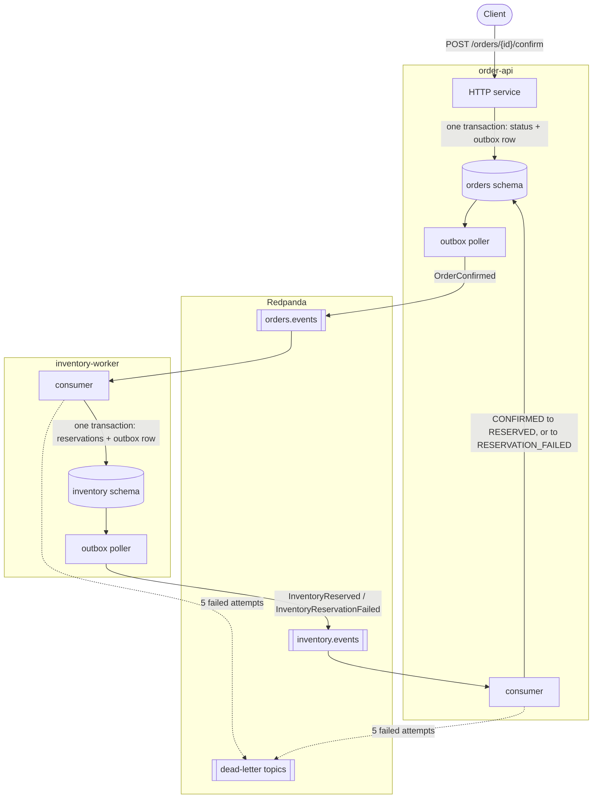

# event-driven-orders

[](https://github.com/ikuko-otani/event-driven-orders/actions/workflows/ci.yml)

An order-management system split into two services that share no database and never call each other.
`order-api` takes an order and confirms it, `inventory-worker` reserves the stock, and everything between them travels through Kafka.

The subject of the project is the machinery that makes that safe: a transactional outbox, a choreographed Saga with compensation, at-least-once delivery absorbed by consumer-side deduplication, and a retry policy that ends in a dead-letter topic.
All of it is first-party code rather than a framework feature, so its failure modes are visible and are exercised by the test suite.

## Architecture

Five processes, two schemas in one PostgreSQL instance, and two business topics.
No arrow crosses from one service's database to the other: the only path between them is the broker.



A confirmed order is answered `200` immediately and reserved asynchronously, so the client learns the outcome by polling `GET /orders/{id}`.
The status it ends on is `RESERVED`, or `RESERVATION_FAILED` when a line has insufficient stock — a business failure, which is a final answer rather than something to retry.
A technical failure is retried in place five times with exponential backoff and is copied to a dead-letter topic only after the last attempt.

Each poller is a singleton on purpose: two of them would publish one order's events out of order.
Details, including why the reservation reply is keyed by order id, are in [the design document](docs/design/domain-design.md).

## Quick start

Requirements: Docker, [uv](https://docs.astral.sh/uv/), and Python 3.12 (pinned by `.python-version`).

```bash
docker compose up -d   # the infrastructure, both migrations, and the five processes
uv run poe seed        # one sales entity, two customers, three items and their stock
uv run poe smoke       # create an order, confirm it, and wait for RESERVED
```

The first command is the whole stack.
It applies both Alembic histories in one-shot services of their own, creates the four topics with the partition counts the design fixes, and only then starts the processes that depend on them — so a fresh clone reaches a working state without a manual step in the middle.

`seed` and `smoke` run on the host rather than in a container, and that is a consequence of the design rather than a convenience.
Both of them import the packages of *both* services, while each image is built with the dependencies of one.
The seed is in fact the only thing in this repository that writes to both schemas: it is a development tool standing outside the rule of design §3.1 that neither service may reach into the other's data, which is precisely why it cannot live inside either service's image.

Once the stack is up:

| What | Where |
|---|---|
| API documentation | <http://localhost:8000/docs> |
| Health | <http://localhost:8000/health> |
| Traces | <http://localhost:16686> (Jaeger) |
| Logs | `docker compose logs -f order-api-poller inventory-worker` |

A one-shot service is hidden by `docker compose ps` once it has finished; `docker compose ps -a` lists it, and `Exited (0)` is its success state rather than a failure.

[A walkthrough](docs/demo.md) drives both outcomes through the running stack — one order reserved, one refused for insufficient stock — with the commands and their real output.

## Repository layout

| Path | Contents |
|---|---|
| `services/order-api` | the HTTP service, its poller and its consumer, and the `orders` Alembic history |
| `services/inventory-worker` | the reservation consumer, its poller, and the `inventory` Alembic history |
| `libs/common` | what the two share: the envelope, the poller loop, the consumer loop, settings, logging and tracing |
| `tests` | one suite for both services, run against real containers |
| `scripts` | the seed and the smoke check |

The loops are shared code; the schemas are not.
Each service owns its own `outbox` and `processed_events` tables, because each of them is both a producer and a consumer.

## Design documents

The design was written before the implementation and is the specification the code follows.

- [Domain design](docs/design/domain-design.md) — the ER diagram, the event catalog and envelope, the Saga and its compensation path, the outbox poller loop, the retry and dead-letter policy, and the scale assumptions the partition count comes from.
- [ADR-001: Kafka as the event broker](docs/adr/001-kafka-as-event-broker.md)
- [ADR-002: Custom outbox poller over Debezium CDC](docs/adr/002-custom-outbox-poller-over-debezium.md)
- [ADR-003: AWS deployment shape](docs/adr/003-aws-deployment-shape.md) — proposed rather than accepted: it is settled when the deployment is built.
- [Technical debt](docs/tech-debt.md) — the known gaps, each with what it would take to close it. Two things the design describes are not implemented, and they are registered there rather than left to be found.

## Development

| Command | What it does |
|---|---|
| `uv run poe check` | format, lint, typecheck, test — the local gate |
| `uv run poe ci` | the same, with the formatter reporting a diff instead of fixing it |
| `uv run poe test` | the test suite alone |

The suite starts PostgreSQL, Redis and Redpanda as testcontainers, so it needs Docker but not the Compose stack, and it runs on the host because the container reaper cannot start from inside a container.
CI runs that gate and, in a job of its own, the smoke check above: the same script, driven through the processes Compose starts rather than reassembled from calls a test makes in order.
