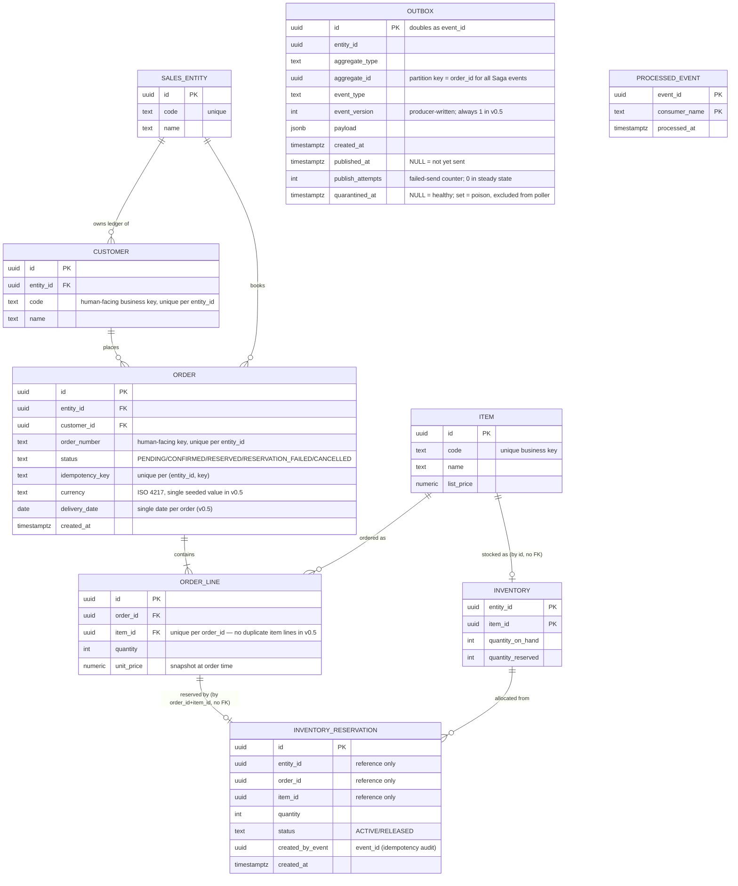

# Domain Design — event-driven-orders

> **Version**: 0.4.2 (draft) — 2026-08-11
> **Status**: ER diagram and event catalog (v0.2); Saga reliability details — outbox poller, retry/DLQ, edge cases — and scale assumptions (v0.3); pre-implementation review fixes — concurrency-safe state transitions, idempotency authority, envelope/outbox mapping, reservation granularity, producer-side poison, and the API state×operation contract (v0.4); editorial pass — authentication recorded in §7, cross-references made self-contained (v0.4.1, no design change). Customer master given a human-facing business key, unique per entity (v0.4.2).
> Broker selection is settled in ADR-001 (Kafka) and ADR-002 (custom outbox poller).

---

## 1. Business Context

This project models a make-to-stock order-management domain for a small manufacturing business: **order intake → inventory reservation → shipment → billing**, with a purchasing (procurement) side alongside.

The domain is grounded in business flows I observed first-hand in professional work:

- **Order-management system for a metal-processing manufacturer** (replacement of a business web system; sole developer, 2022–2023): order intake with a header + order-lines structure (multiple items per order), inventory management, shipment instruction, and invoicing.
  Purchasing (issuing purchase orders to suppliers) was also in scope.
- **Production-management package customization (MCFrame)** for a pharmaceutical manufacturer, where I first observed the concept of *inventory reservation* — allocating stock to a specific order.
  This is also where I first worked on a system handling **multiple corporate entities within a single system**, the origin of the *multi-entity* axis carried in this schema (§3.2).
- **Finance/accounting web system for a supermarket group** (2015–2019): I implemented consolidated reporting across the group's companies.
  This is cross-company consolidation — related to, but distinct from, a single system modeling multiple entities — and the multi-entity requirement is itself a staple of accounting/finance SaaS.

**This repository is a personal portfolio project.**
It does not reproduce any employer's or client's system; it re-models generic domain flows, informed by that experience, on a modern event-driven stack.

### Design principle: every state must be mechanically reproducible

A recurring pain point in the business systems above was integration-test data: testing a downstream stage (e.g., shipment) requires upstream data (orders, reservations) in exactly the right state, and constructing that state by hand requires knowing every preceding step in detail.
This project treats that as a first-class design constraint:

> Any domain state used in a test must be reproducible mechanically — via factories and/or by replaying a recorded event sequence — never by hand-crafted one-off fixtures.

Two complementary techniques satisfy this constraint:

- **Factories** build a target state directly (e.g., an order already in `RESERVATION_FAILED` state) through a single parameterized helper, hiding the cross-table consistency logic in one place instead of re-deriving it by hand in every test.
- **Event replay** builds the same state by publishing real domain events (e.g. `OrderConfirmed`) and letting the real consumers process them, exercising the production code path itself rather than a test-only shortcut.
  This is the higher-fidelity option and the natural fit for testing the Saga/outbox/idempotency machinery this project centers on.

Factories are the default for unit- and API-level tests; event replay is reserved for integration tests that verify the Saga wiring end to end.

## 2. Scope (v0.5)

v0.5 models the **sell side only**: order intake and inventory reservation, including the failure path.

**In scope**

- Order CRUD with HTTP-level idempotency (client-supplied `Idempotency-Key`); per-state operation outcomes in §4.6
- Order confirmation event published via a transactional outbox (custom Python poller relay — no Debezium)
- Inventory reservation by an idempotent consumer (`processed_events` table)
- Compensation (Saga) for reservation failure, with retry policy and a DLQ topic
- Observability: OpenTelemetry distributed tracing + structured logging (simplification is the designated de-scoping step if capacity runs short)
- CI: GitHub Actions (pytest + testcontainers + Redpanda)

**Stack**: order-api is a FastAPI application; inventory-worker is a Python consumer; PostgreSQL backs both schemas, and Kafka runs as a single-node Redpanda locally (ADR-001).

**Multi-entity note**: the schema and event envelope carry an `entity_id` (sales company) from day one, but v0.5 seeds exactly **one** entity and implements no entity-scoped features.
Rationale in §3.2 and §7.

**De-scoping order** (if capacity runs short, applied in this order): the multi-entity functional layer (§7) first, then the `customers` master (§3.2), then simplify observability to structured logging only. (Stretch items are by definition already out of v0.5, §7.)
The Saga, outbox, and idempotency machinery are never de-scoped — demonstrating them is the point of the project.

**Out of scope / stretch** — deferred deliberately; see §7.

## 3. ER Diagram



### 3.1 Service ownership

| Schema | Owner service | Tables |
|---|---|---|
| `orders` | order-api | sales_entities, customers, orders, order_lines, items, outbox, processed_events |
| `inventory` | inventory-worker | inventory, inventory_reservations, outbox, processed_events |

One PostgreSQL instance locally, two schemas.
**No cross-schema foreign keys and no cross-schema queries** — the only integration path between the two services is Kafka.
`item_id` / `entity_id` values in the `inventory` schema reference the masters by convention only (seeded consistently), not by FK.
Both services own an `outbox` and a `processed_events` table because both act as event producer *and* consumer.

### 3.2 Entity notes

- **sales_entities** — master of sales companies (corporate entities), the "multi-entity" axis common in accounting/finance SaaS.
  v0.5 seeds exactly one entity and implements no entity-scoped features.
  The `entity_id` column is nevertheless baked into the schema and the event envelope from day one: retrofitting it later means rewriting every table and every event, while deferring only the *functional* layer (data-isolation guarantees, per-entity document numbering, API scoping) keeps the de-scoping decision reversible (§7).
- **customers** — seeded master data, scoped to a sales entity; no CRUD API in v0.5.
  Exists to keep the FK design realistic instead of a free-text customer name.
  `code` is the human-facing business key, carrying that same argument one step further: a customer master identified only by a name is exactly the unrealistic shape this table exists to avoid.
  It is unique per `entity_id` rather than globally — a customer ledger belongs to a sales entity, so two entities may reuse a code for different customers — the same scoping `orders.order_number` has, and deliberately not the global uniqueness of `items.code`, whose catalog is shared across entities in v0.5.
  De-scoping candidate if capacity runs short.
- **orders** — aggregate root of order intake.
  `status` lifecycle: `PENDING → CONFIRMED → RESERVED | RESERVATION_FAILED`; `CANCELLED` is reserved for future user-initiated cancellation (per-state operation outcomes: §4.6).
  `order_number` is the human-facing business key (unique per `entity_id`), separate from the technical `id`; it is included from v0.5 — even though no numbering scheme beyond a simple sequence exists yet — because retrofitting it later would require backfilling every existing row with a number.
  `idempotency_key` is the HTTP-level deduplication key (client-supplied, unique per `(entity_id, idempotency_key)`); this UNIQUE constraint is the durable authority for HTTP idempotency, with Redis fronting it as a response cache, while the event-level mechanism is `processed_events` (see §4.4).
  `currency` (ISO 4217) is seeded as a single value in v0.5; it is carried on the order because a monetary amount recorded without its currency cannot be reinterpreted later without a breaking change to the event payload.
  Delivery date is a single header-level date in v0.5.
- **order_lines** — `unit_price` is a snapshot of the item's list price at order time: an accepted order must not change retroactively when the price master changes.
- **items** — owned by order-api.
  `code` is the human-facing business key; `id` (UUID) is the technical key used in FKs and event payloads.
  The catalog is shared across sales entities in v0.5; per-entity catalogs are part of the deferred multi-entity functional layer (§7).
- **inventory** — one row per `(entity_id, item_id)`: each sales entity holds its own stock.
  Available quantity = `quantity_on_hand − quantity_reserved`.
  The row is locked (`SELECT … FOR UPDATE`) during reservation so the counter update and the reservation-row insert commit atomically.
  When one order reserves several items, the rows are locked in a deterministic order (**by `item_id`**), so two orders touching the same pair of items cannot deadlock by taking the locks in opposite orders.
- **inventory_reservations** — reservations are stored as rows, not just a counter, because (1) Saga compensation then has a precise inverse operation (mark the row `RELEASED` and decrement the counter), and (2) the rows are an audit trail of which order holds which stock.
  `created_by_event` records the event that created the reservation.
  **Granularity: one reservation per `(order_id, item_id)`.** v0.5 forbids duplicate item lines within an order (`UNIQUE (order_id, item_id)` on `order_lines`), so a reservation maps to exactly one order line by that pair — the linkage the ER draws as `ORDER_LINE ⋯ INVENTORY_RESERVATION`, carried by value (no cross-schema FK). A partial unique index **`UNIQUE (order_id, item_id) WHERE status = 'ACTIVE'`** lets an order hold at most one active reservation per item: this is the consumer-side second line of defense promised in §5.7 — a duplicate or replayed `OrderConfirmed` that slipped past the write-path guard cannot double-reserve, because the second insert hits the constraint, which the consumer treats as *already reserved* (an idempotent no-op: record in `processed_events`, emit no further `InventoryReserved`), not a retry or DLQ case. Lifting the no-duplicate-lines rule later (the deferred per-line delivery dates of §7) is a versioned change — add `order_line_id` to the reservation and to the `InventoryReserved` payload, and relax the constraint — bounded, not a cascade.
- **outbox** — one per schema; the transactional-outbox table.
  Events are written in the same DB transaction as the business change (avoiding the dual-write problem), then published to Kafka by a separate poller process.
  `id` doubles as the event id.
  The poller publishes rows where `published_at IS NULL` (and not quarantined, §5.4) and marks them afterwards, so delivery is **at-least-once**.
- **processed_events** — consumer-side deduplication for at-least-once delivery: PK `(event_id, consumer_name)`; insert first, skip processing if the row already exists.
  `consumer_name` is the **logical** consumer (the consumer-group name), never a per-instance identifier — otherwise a redelivery to a different instance (§5.7 path #5) would not be recognised as a duplicate.

> Naming note: table names are plural (`orders`) because `order` is an SQL reserved word.

## 4. Event Catalog

### 4.1 Envelope standard

All events share one envelope; `payload` differs per event type.

```json
{
  "event_id": "0198c0de-…",
  "event_type": "OrderConfirmed",
  "event_version": 1,
  "occurred_at": "2026-08-15T09:30:00Z",
  "entity_id": "<sales_entity_id>",
  "aggregate_type": "Order",
  "aggregate_id": "<order_id>",
  "payload": {}
}
```

- `event_id` is the outbox row's UUID and is the deduplication key (§4.4).
- `event_version` is always `1` in v0.5; the field exists so payload-schema evolution has a defined place to happen (no schema registry in v0.5 — ADR-001).
- The envelope is **materialized from the outbox row** by the poller (§5.4), which stays a content-agnostic relay: it does only mechanical field remapping — `event_id ← id`, `occurred_at ← created_at` — and copies `entity_id`, `aggregate_type`, `aggregate_id`, `event_type`, `event_version`, `payload` verbatim from the columns of the same name. `event_version` is written by the **producer** (the side that knows the payload contract), never interpreted by the poller; it stays `1` throughout v0.5 and is the one field a future second payload version would change.
- Event names are **past-tense facts** (`OrderConfirmed`, never `ConfirmOrder`): an event records something that already happened and cannot be rejected.
  Failures are therefore handled by appending compensating facts, not by undoing (§5).

### 4.2 Topics and partitioning

| Topic | Producer | Contents |
|---|---|---|
| `orders.events` | order-api | all events order-api produces (order-lifecycle facts) |
| `inventory.events` | inventory-worker | all events inventory-worker produces (reservation replies) |
| `<topic>.<consumer>.dlq` | (consumer) | dead-letter topic per consumer |

- **Message key = `order_id`.** Kafka guarantees ordering only within a partition; keying by order id keeps all events about one order in order.
  This is realized by the outbox: **every Saga event, on both topics, stores `aggregate_id = order_id`**, so the poller's `key = aggregate_id` (§5.4) yields `order_id` uniformly. Inventory-worker's events (`InventoryReserved`, `InventoryReservationFailed`) are steps in the order's choreographed Saga, so their correlating aggregate is the Order too — `aggregate_type = "Order"`, `aggregate_id = <the order_id being processed>` — even though the rows they write live in the `inventory` schema. Keying an inventory event on an inventory-side id would silently break per-order ordering on the order-api consumer.
- **One topic per producing service, not per event type**: each service writes all of its events to its own topic, so everything a single consumer must apply in `order_id` order arrives on one partition of one topic. (Order-aggregate events do span both topics — `OrderConfirmed` on `orders.events`, the reservation reply on `inventory.events` — but each is read by a different service, and their relative order is fixed by Saga causality (§5), not by partitioning.)

### 4.3 Events (v0.5)

#### OrderConfirmed

| | |
|---|---|
| Producer → consumers | order-api → inventory-worker |
| Trigger | `POST /orders/{id}/confirm` transitions the order `PENDING → CONFIRMED`; the outbox row is written in the same DB transaction |
| Payload | `order_id`, `order_number`, `customer_id`, `delivery_date`, `currency`, `lines: [{item_id, quantity}]` |

Payload style is **event-carried state transfer**: the consumer gets everything it needs (the order lines) from the event itself and never calls order-api back.
A notification-style event (id only) would reintroduce a synchronous dependency and defeat the purpose of the async design; the price is that the payload schema becomes a contract, tracked by `event_version`.

#### InventoryReserved

| | |
|---|---|
| Producer → consumers | inventory-worker → order-api |
| Trigger | **All** lines of the order were reserved in one local DB transaction (all-or-nothing per order) |
| Payload | `order_id`, `reservations: [{item_id, quantity, reservation_id}]` |

On consumption, order-api transitions the order `CONFIRMED → RESERVED`.

#### InventoryReservationFailed

| | |
|---|---|
| Producer → consumers | inventory-worker → order-api |
| Trigger | At least one line had insufficient available stock; the whole reservation transaction rolled back, so no partial reservations remain |
| Payload | `order_id`, `failures: [{item_id, requested, available}]` |

On consumption, order-api transitions the order `CONFIRMED → RESERVATION_FAILED` (the Saga compensation, §5).

The payload deliberately carries `requested` vs `available` per failed line — exactly the information an operator (or a future automated order-splitting feature, §7) needs to decide how to split the order into a fulfillable part and a backorder.
The event design anticipates that capability without implementing it.

### 4.4 Idempotency design

Two independent layers:

| Layer | Key | Authority | Protects against |
|---|---|---|---|
| HTTP | client-supplied `Idempotency-Key` header, unique per `(entity_id, key)` | `orders.idempotency_key` UNIQUE constraint (durable); Redis as a response cache in front | client retries creating duplicate orders |
| Event | `event_id` (outbox row UUID) | `processed_events` row (durable) | at-least-once redelivery (outbox poller resend, consumer restart/rebalance) |

**HTTP layer — the constraint is the authority, Redis is only a cache.**
The `orders` table carries `idempotency_key` UNIQUE per `(entity_id, idempotency_key)` (§3.2), and the order INSERT *is* the idempotency claim: a retried or concurrent `POST /orders` carrying the same key attempts a second INSERT, hits the unique violation, and the handler responds by loading and returning the already-created order (HTTP 200) instead of creating a new one.
Because the claim is the same row write that creates the order, concurrency needs no separate lock — the second INSERT blocks on the unique index until the first commits, then sees the violation, the same mechanism that makes confirm safe under concurrency (§5.7).
Redis sits in front purely as a **response cache**: a successful create stores the response body under the idempotency key with a 24-hour TTL; a retry that hits the cache replays the stored response without touching Postgres.
A cache miss — cold start, eviction, TTL expiry, or a Redis restart — falls through to the constraint, so **losing the Redis data is a latency regression, never a correctness one**.
The durable guarantee lives in Postgres; Redis only makes the idempotent replay fast, exactly as the event layer keeps its guarantee in `processed_events` rather than in memory.
v0.5 has no authenticated principal (§7), so the key is scoped per `(entity_id, key)`; adding auth later widens the scope to the calling principal, so one client's key cannot collide with another's.

**Rejected alternative** — deduplicating on a business key (`order_id` + state transition): it cannot distinguish a legitimate re-processing of the same order (e.g. a future cancel-and-reconfirm flow) from a duplicate delivery.
The outbox supplies a fresh UUID per event for free, so `event_id` deduplication is both simpler and more precise.

### 4.5 Reserved future events (not implemented in v0.5)

`OrderCancelled`, `OrderShipped`, `InvoiceIssued` — names reserved so the status model and topic layout can grow toward the shipment/billing stages listed in §7.

### 4.6 Order API contract — state × operation

`status` lifecycle (§3.2): `PENDING → CONFIRMED → RESERVED | RESERVATION_FAILED`; `CANCELLED` is reserved (§4.5), unreachable in v0.5.

**Client operations × state** — the mutating cells are all conditional updates guarded on the current state (§5.7):

| State | `GET /orders/{id}` | `PATCH`/`DELETE` | `POST …/confirm` |
|---|---|---|---|
| PENDING | 200 | 200 / 204 | 200 → CONFIRMED, emits `OrderConfirmed` |
| CONFIRMED | 200 | 409 | 200 no-op |
| RESERVED | 200 | 409 | 200 no-op |
| RESERVATION_FAILED | 200 | 409 | 200 no-op |
| CANCELLED *(future)* | 200 | 409 | 409 |
| *(absent)* | 404 | 404 | 404 |

**Invariant: only the `PENDING → CONFIRMED` cell writes an `OrderConfirmed` outbox row.**
Every other `confirm` cell is read-only (200 no-op, 404, or 409), so no order can emit a second `OrderConfirmed` — the contract-level half of the duplicate-confirm guard whose write-path half is the conditional `UPDATE` of §5.7.
A `CONFIRMED`+ order is immutable because its lines are now a published contract (`OrderConfirmed`); mutation is refused to keep the event and the row in agreement.
Recovering a `RESERVATION_FAILED` order is a future capability (order splitting / backorder, §7), not a re-confirm.

**Why `confirm` returns 200, not 202.**
The action this endpoint contracts to perform — the `PENDING → CONFIRMED` transition and its outbox write — completes synchronously and commits within the request, so 200 (done) is accurate.
202 would imply the confirm itself is still pending, whereas what is asynchronous is the *downstream* reservation, observed as a later state via `GET /orders/{id}` (§5.2).
Keeping 200 also holds the endpoint to one uniform code across the transition and its idempotent no-op replays.

**Consumed events × state** — order-api applies inventory events as guarded updates:

| Incoming event | Applied as | Unexpected state **or absent order** |
|---|---|---|
| `InventoryReserved` | `UPDATE … SET status='RESERVED' WHERE id=:id AND status='CONFIRMED'` | 0 rows affected → deterministic mismatch: record in `processed_events`, emit a warning-level anomaly, change nothing |
| `InventoryReservationFailed` | `UPDATE … SET status='RESERVATION_FAILED' WHERE id=:id AND status='CONFIRMED'` | same 0-rows branch |

The conditional `UPDATE` folds "order absent" and "wrong state" into one 0-affected-rows branch, so a missing `order_id` needs no special case — it is deterministic and is neither retried nor DLQ'd.

**Missing referenced master is different.**
If an `OrderConfirmed` names an `item_id` with no `(entity_id, item_id)` inventory row, that is a data-integrity violation (masters are seeded, §3.1), *not* a business "0 available".
Inventory-worker treats it as a deterministic error and sends the event straight to the DLQ (fixable by correcting the seed, then re-inject, §5.6) — never silently reinterpreted as `RESERVATION_FAILED`.

**Error catalog (v0.5):**

| Endpoint | Success | Client errors |
|---|---|---|
| `POST /orders` | 201 created / 200 idempotent replay (§4.4) | 422 (empty or duplicate lines, over the line cap) |
| `GET /orders/{id}` | 200 (status, lines, reservation summary) | 404 |
| `POST /orders/{id}/confirm` | 200 (current status) | 404 |
| `PATCH`/`PUT /orders/{id}` | 200 | 404 · 409 (not PENDING) · 422 |
| `DELETE /orders/{id}` | 204 | 404 · 409 (not PENDING) |

## 5. Saga Overview — inventory reservation failure

> §5.1–5.3 give the high-level flow; §5.4–5.7 add the reliability machinery: outbox poller design, retry policy, DLQ operations, and edge cases.

### 5.1 Why a Saga (and not a distributed transaction)

The order confirmation spans two services and a broker; there is no shared transaction coordinator, and two-phase commit across services would couple their availability (one slow participant blocks the other's locks).
The Saga pattern replaces the global transaction with a **sequence of local transactions**, each atomic on its own, where a failure later in the chain is answered by a **compensating action** — a new fact that semantically cancels an earlier one, never an undo.
(The accounting analogy: a posted journal entry is corrected by a reversing entry, not by erasure.)

v0.5 uses **choreography** (each service reacts to events; no central orchestrator): with two services and one interaction, an orchestrator would be pure overhead.
The trade-off — choreographed flows get hard to follow as the number of steps grows — is documented as the trigger for revisiting this choice if the flow ever gains steps.

### 5.2 Flow

```mermaid
sequenceDiagram
    participant C as Client
    participant O as order-api
    participant K as Kafka
    participant I as inventory-worker

    C->>O: POST /orders/{id}/confirm
    O->>O: tx: status PENDING→CONFIRMED + outbox(OrderConfirmed)
    O-->>C: 200 OK (status=CONFIRMED; reservation is async)
    O->>K: poller publishes OrderConfirmed
    K->>I: OrderConfirmed
    alt all lines available
        I->>I: tx: reservations + counters + processed_event + outbox(InventoryReserved)
        I->>K: poller publishes InventoryReserved
        K->>O: InventoryReserved
        O->>O: tx: processed_event + status CONFIRMED→RESERVED
    else insufficient stock (business failure)
        I->>I: tx: processed_event + outbox(InventoryReservationFailed) — no reservation rows
        I->>K: poller publishes InventoryReservationFailed
        K->>O: InventoryReservationFailed
        O->>O: tx: processed_event + status CONFIRMED→RESERVATION_FAILED (compensation)
    end
```

The client observes the outcome by polling `GET /orders/{id}` (the confirm endpoint answers as soon as the order is confirmed; the reservation result arrives asynchronously).

### 5.3 Business failure vs technical failure

A subtlety that shapes the consumer implementation:

- **Business failure** (insufficient stock) is a *successful* processing outcome.
  The consumer's transaction **commits** — recording the `processed_events` row and the `InventoryReservationFailed` outbox row, while writing no reservation rows.
  It must not be retried.
- **Technical failure** (DB down, crash mid-processing) aborts the whole transaction *including* the `processed_events` insert, so at-least-once redelivery retries it safely.
  After N failed attempts the event goes to the consumer's DLQ topic for manual inspection (retry policy: §5.5; DLQ operations: §5.6).

Conflating these two — e.g. rolling back everything on insufficient stock — would make the consumer retry a permanent business condition forever.

### 5.4 Outbox poller design

Each service runs its own poller as a separate process (order-api poller and inventory-worker poller), publishing that service's `outbox` rows to Kafka.

```
loop forever:
    rows = SELECT * FROM outbox
           WHERE published_at IS NULL AND quarantined_at IS NULL
           ORDER BY created_at
           LIMIT :batch_size            -- 100
    for row in rows:
        produce(topic, key=row.aggregate_id, value=envelope(row))
    flush()                             -- wait for broker acks; per-row errors arrive in delivery callbacks, never crash the loop
    UPDATE outbox SET published_at = now()
        WHERE id IN (:acked_ids)        -- successes only, one statement
    for id in :failed_ids:              -- sends the broker rejected
        UPDATE outbox
           SET publish_attempts = publish_attempts + 1,
               quarantined_at = CASE WHEN <permanent error> OR publish_attempts + 1 >= :max_attempts
                                     THEN now() ELSE NULL END
         WHERE id = :id                 -- transient: retried next cycle; poison: quarantined + alert
    if len(rows) < batch_size:
        sleep(:poll_interval)           -- 100 ms; skip sleep while draining backlog
```

**Publish before mark.**
The order of steps is the at-least-once guarantee itself: a crash after `flush()` but before the `UPDATE` re-publishes those rows on restart (duplicate — absorbed by `processed_events`, §4.4), whereas the reverse order (mark, then publish) would lose events that were marked but never sent — at-most-once.
The crash window is analyzed in §5.7.

**Polling interval: 100 ms.**
Polling adds on average half the interval (worst case: the full interval) to event latency, and the confirm→reserved round trip crosses **two** pollers (order-api's and inventory-worker's), so the interval enters the end-to-end latency budget twice.
100 ms keeps the worst-case polling contribution at ~200 ms; the idle-cycle query is a cheap scan of a small partial index (below), so the DB cost of polling 10×/s is negligible.
Revisit against the p99 target in §6 (and against the planned load-test measurements).

> Rejected alternative — PostgreSQL `LISTEN`/`NOTIFY` push instead of polling: notifications are lost while the listener is disconnected, so a polling fallback is required anyway; v0.5 keeps polling only.

**Batch size: 100.**
At the assumed throughput (§6) an idle-free cycle carries ~50 events, so 100 gives headroom; during a backlog (e.g. after poller downtime) the loop skips the sleep and drains at full speed.
Both `poll_interval` and `batch_size` are externalized configuration, to be re-tuned from the load-test results.

**Producer configuration: `enable.idempotence=true` (implies `acks=all`).**
The at-least-once claim in §3.2 silently depends on this: with `acks=0` the producer reports success without broker confirmation, so the poller would mark rows as published that the broker never received — at-most-once.
`acks=all` closes the remaining loss window of `acks=1` (leader failure before replication).
Idempotence additionally deduplicates the producer's *internal* retries on the broker (an ack lost in the network would otherwise create a second copy) and preserves send order under retries — reducing duplicates at the source even though `processed_events` would absorb them anyway.

**Marking: successes only, one `UPDATE` per batch.**
After `flush()`, only rows whose ack was confirmed are marked; failed rows keep `published_at IS NULL` and are retried on the next cycle automatically — the outbox table doubles as the publish-retry queue, so no separate retry machinery exists on the producer side.
Ordering under partial failure is discussed in §5.7.

**Producer-side poison: quarantine, don't loop.**
"Retried on the next cycle automatically" is safe only for *transient* send failures (broker unreachable, timeout); a *deterministic* one — a payload over the broker's `max.request.size`, an un-encodable value — would otherwise be re-selected and re-sent forever, silently stalling that row's order while the outbox depth barely moves.
So a failed send increments `publish_attempts`, and a row that returns a permanent broker error (or crosses `max_attempts`) is stamped `quarantined_at` and dropped from the poller's query — the producer-side analogue of the consumer DLQ (§5.6).
Per-row send errors are captured in the delivery callback and never crash the loop, so one poison row cannot stop the service's other events.
This mirrors the consumer rule (§5.5) that a deterministic failure skips retry and goes straight to the dead-letter path; its runbook and visibility metrics are in §5.7 and §6.4.

**Single poller instance per service, by design.**
The poller is a singleton; this is an operational rule, not enforced by code.
Its availability requirement is soft: a dead poller delays events but never loses them (rows accumulate in the outbox and are drained on restart), so a restart-on-crash supervisor is sufficient.

> Rejected alternative — multiple pollers with `SELECT … FOR UPDATE SKIP LOCKED`: the idiom removes row contention, but rows of the same aggregate can then be published by different pollers in any order, breaking the per-order ordering guarantee of §4.2; recovering it would require aggregate-affine work assignment, which is orchestration complexity v0.5 has no throughput justification for.

**Supporting index.**
`CREATE INDEX outbox_unpublished ON outbox (created_at) WHERE published_at IS NULL AND quarantined_at IS NULL` — the poller's hot query scans only healthy unpublished rows, and the index stays near-empty in steady state.
Published rows are retained for audit in v0.5; a retention/cleanup job is deliberately deferred.

### 5.5 Retry policy (technical failures)

Everything in this section applies to **technical failures only**; a business failure commits and is final (§5.3).

**Mechanism: in-process blocking retry.**
On an exception, the consumer retries the message in place — sleep, re-run the processing transaction — without committing the offset and without moving on.
Retry is reserved for *possibly-transient* failures; a failure that is deterministic by construction (e.g. the message cannot be deserialized) skips the retry cycle and goes straight to the DLQ (§5.7).
Later messages in the partition wait behind it (head-of-line blocking), which is accepted deliberately:

- Most technical failures are **environmental**, not message-specific: if the DB is down, every subsequent message would fail identically, so there is nothing useful to unblock.
- Blocking is the only variant that preserves the per-order ordering guarantee of §4.2 for free.

> Rejected alternative — retry topics (`…retry-5s`, `…retry-1m`, …) as used in high-throughput deployments: the main partition keeps flowing, but events of the same key overtake each other while one sits in a delay topic, breaking per-order ordering; it also roughly doubles the topic/consumer surface.
> Nothing at this project's scale justifies that trade.

**Schedule: 5 attempts total (1 initial + 4 retries), exponential backoff 1 s → 2 s → 4 s → 8 s, full jitter.**
Total worst-case wait is ~15 s.
The jitter prevents synchronized retry spikes from multiple consumers hammering a recovering DB at the same instant.

**Upper bound.**
The schedule is not free to grow: a consumer that does not call `poll()` within `max.poll.interval.ms` (default 5 min) is evicted from the group, its partitions are rebalanced away, and the same message is redelivered elsewhere — a retry loop disguised as progress.
Rule: *(single-attempt processing time + total backoff) must stay well below `max.poll.interval.ms`*.
~15 s against 5 min leaves ample margin; if the schedule is ever lengthened, both values must move together.

**Retry count lives in a local variable of the consumer's retry loop** — nowhere else.
If the process crashes mid-retry, the count resets and the redelivered message starts a fresh cycle; this is accepted because exception-type failures are bounded by the counter, and failures that kill the process outright are the poison-message case (§5.7).

> Rejected alternative — persisting the count in the DB or in republished message headers: the DB is the very component most likely to be failing during a retry, and headers require republishing (the retry-topic machinery rejected above).

**After the last attempt fails, the message goes to the consumer's DLQ (§5.6), and only then is the offset committed.**

### 5.6 DLQ operations

One DLQ topic per (source topic, consumer) pair, named `<topic>.<consumer>.dlq` (§4.2) — e.g. `orders.events.inventory-worker.dlq`.
Business failures never enter a DLQ; they are committed outcomes, not errors.

**Message format: the original message, byte-for-byte, with diagnostics in Kafka headers.**
Keeping the payload untouched means re-injection is a plain republish with no unwrap step.
Headers carry: original topic / partition / offset, exception class and message, attempt count, failure timestamp, consumer name.

**Producing to the DLQ and committing.**
The offset of the failed message is committed only after the DLQ producer confirms the ack (idempotent producer, same configuration as §5.4).
If the DLQ publish itself fails — usually meaning Kafka as a whole is unhealthy — the consumer crashes without committing and lets the supervisor restart it: the message is redelivered later, and no code path exists in which it is silently dropped.

**Re-injection runbook.**

1. **Detect** — DLQ depth > 0 is an operator signal.
   v0.5 checks manually (console consumer); a metric + alert on DLQ depth is the designated growth path once observability lands.
2. **Inspect** — read the DLQ messages and their diagnostic headers; classify the cause: environmental (DB outage window) vs message-specific (bug, malformed payload).
3. **Fix the root cause first** — restore the infrastructure, or deploy the code fix.
   Re-injecting before the cause is fixed only round-trips the message back into the DLQ.
4. **Re-inject** — a small CLI script consumes the DLQ and republishes each original value to the **original topic with the original key** (`order_id`), so partition assignment and per-order ordering resume as if the event had just been published.
   The script supports selecting a subset (by `event_id` or offset range) for the message-specific case.
5. **Safety argument** — the re-injected event carries its original `event_id`, so even if the failed attempt had actually committed before crashing, `processed_events` (§4.4) absorbs the duplicate.
   **Re-injection is safe for data integrity — it can neither lose nor double-process — so when in doubt, re-inject; the one exception is a grade-(c) poison message (§5.7), which must wait for its root-cause fix or it will only crash-loop back in.**
   A message that fails again simply travels the same §5.5 cycle back into the DLQ — no new failure mode.

Note that step 5 is not an operational convention but a *consequence of the idempotency design*: the same `event_id` deduplication that absorbs at-least-once redelivery makes manual recovery idempotent too.
DLQ topic retention (14 days) is set comfortably longer than any realistic manual response time, so messages cannot expire while an incident is still being worked.
`processed_events` rows must be retained at least as long as any event can still be redelivered — no shorter than this DLQ retention — so even a 14-day-late re-injection is deduplicated; a cleanup job that violated this invariant would reintroduce double-processing.

### 5.7 Edge cases

Each case below follows the same shape: *scenario → what actually happens → which existing mechanism absorbs it (or which new rule this section adds)*.
The recurring theme is that publish-before-mark (§5.4) and commit-before-offset (below) convert every crash window into a **duplicate**, and duplicates all drain into one mechanism: `processed_events` (§4.4).

#### Poller crash (re-send before the `published_at` mark)

| Crash position in the §5.4 loop | Consequence |
|---|---|
| after `SELECT`, before `produce` | nothing sent, rows unmarked — clean re-run, no effect |
| mid-`flush` (some acks in, some not) | sent-but-unmarked rows re-published on restart — duplicates |
| after `flush`, before the `UPDATE` | same: re-published on restart — duplicates |

Choosing publish-before-mark already converted the failure mode from *loss* to *duplication*; this table just enumerates the windows.

One caveat matters: the idempotent producer (§5.4) deduplicates only retries **within one producer session**.
A restarted poller has a new producer id, so restart re-sends are *not* deduplicated at the broker.
The division of responsibility is therefore: producer idempotence is a source-side optimization; **the consumer's `processed_events` is the actual guarantee**, and it is the only mechanism that spans process restarts.

#### Double publish — inventory of every duplicate path

| # | Duplicate source | Suppressed / absorbed by |
|---|---|---|
| 1 | poller crash after `flush`, before mark (above) | `processed_events` |
| 2 | producer internal retry after a lost ack | idempotent producer (broker-side, same session) |
| 3 | partial-failure batch: an acked row left unmarked (§5.4) | `processed_events` |
| 4 | operational error: two poller instances running | `processed_events` (ordering hazard noted in §5.4) |
| 5 | consumer redelivery (crash/rebalance before offset commit) | `processed_events` |
| 6 | DLQ re-injection of an already-processed event (§5.6) | `processed_events` |

Every path except #2 converges on the same table.
The insert into `processed_events` shares the transaction with the business change, which is exactly what turns at-least-once *delivery* into effectively-once *processing*.

Upstream of the outbox, the same question exists at the HTTP layer: a client retrying `POST /orders/{id}/confirm`, or two of its retries running concurrently, must not insert a second outbox row.
It does not — **provided the transition is a single conditional `UPDATE`, not a read-then-write**:

> **Rule: every status transition is performed as `UPDATE … SET status=:new WHERE id=:id AND status=:expected`, branching on the affected-row count — never by reading the status, comparing in the application, then writing back.**

For confirm: `UPDATE orders SET status='CONFIRMED' WHERE id=:id AND status='PENDING'`. One row affected means this call won the transition and writes the `OrderConfirmed` outbox row in the same transaction; zero rows means the order had already left `PENDING`, so the endpoint returns 200 and writes nothing.
The read-then-write alternative is the trap: under two concurrent confirms both `SELECT`s observe `PENDING` (neither uncommitted transaction is visible to the other under READ COMMITTED), both proceed, and two `OrderConfirmed` rows are written with **distinct `event_id`s**. That is the one duplicate `processed_events` cannot absorb — event-level deduplication keys on `event_id`, and these are two genuinely different events, so the inventory consumer would reserve the stock twice. The affected-row count closes the window at the source.
As defense in depth, the inventory consumer also carries a hard backstop against double-reservation — a partial unique index on active reservations (§3.2) — so even a guard bug cannot reserve an order's stock twice.

#### Consumer offset-commit ordering

> **Rule: the DB transaction (business change + `processed_events` + any outbox rows) commits first; the Kafka offset is committed only after.
> `enable.auto.commit` is disabled.**

The reverse order is the one mistake this design cannot absorb: if the offset is committed and the process dies before the DB commit, Kafka considers the message consumed and never redelivers it — no `processed_events` row was written, but none will ever be checked, because the message never arrives again.
The deduplication machinery is silently bypassed and delivery degrades to at-most-once.

With the correct order, the crash window (DB committed, offset not yet) produces a redelivery, which is duplicate path #5 above — absorbed.
Put differently: **this window is the reason `processed_events` exists.**
The window cannot be closed, so it is made safe instead.

#### Event order reversal

Per-order ordering rests on key = `order_id` → one partition (§4.2).
The paths that could still reorder events, and why v0.5 is safe on each:

- **Cross-cycle re-publish by the poller** — if two unpublished events for one order coexisted and the older one failed to send while the newer succeeded, the older would arrive late.
  In v0.5 this is structurally impossible: the Saga emits each event only after consuming the previous one, so **at most one event per order is unpublished at any time**.
  Within a single cycle, the idempotent producer preserves partition order under retries and fails subsequent sends on a fatal sequence gap, so no overtaking occurs there either.
- **DLQ re-injection arriving after later events of the same order** — in v0.5 a DLQ'd event means that order's Saga is stalled, so no later events exist to be overtaken.
- **State-machine guard as defense in depth** — this is the same conditional-`UPDATE` rule seen from the consumer side: applying `InventoryReserved` is `UPDATE orders SET status='RESERVED' WHERE id=:id AND status='CONFIRMED'`, so an event arriving in an unexpected state (e.g. `InventoryReserved` for an order already in `RESERVATION_FAILED`) affects zero rows. The consumer records the event in `processed_events` and emits a **warning-level anomaly signal** — not a silent no-op: reaching this branch means either a reordering the design believes impossible or a bug, so it must be surfaced and alerted on, not swallowed.
  Retrying would be meaningless (the mismatch is deterministic), and the DLQ is wrong too: §5.6 defines the DLQ as holding messages that can succeed after a fix, which this is not.

> **Constraint carried forward**: both bullets above lean on "one outstanding event per order".
> The moment an aggregate can have several events in flight (`OrderCancelled` racing `OrderConfirmed`, §4.5), three paths must be re-analyzed: cross-cycle re-publish ordering, DLQ re-injection ordering, and a third that is harmless only under one-in-flight — the poller orders by `created_at`, which is not the commit-visibility order, so a long transaction that stamped an earlier `created_at` can become visible *after* a later one and be published out of order.
> This is a documented precondition, not a solved problem.

#### Poison message

A poison message fails deterministically on every attempt.
Three grades, by how much damage it does:

- **(a) Throws an exception** — the normal §5.5 cycle handles it: 5 attempts (~15 s of bounded blocking), then DLQ, offset committed, partition flows again.
- **(b) Cannot be deserialized** — retrying a parse failure is pointless by construction, so it skips retry and goes straight to the DLQ (§5.5).
  Since the envelope (and thus `event_id`) may be unreadable, the raw bytes are shipped as-is with the diagnostic headers.
- **(c) Kills the process** (OOM, native crash) — the worst case, and the accepted weakness of the in-memory retry count (§5.5): every crash resets the count, so redelivery → crash loops forever and the partition stalls.
  v0.5 answers with **documented residual risk plus a manual runbook**, not machinery: the supervisor's restart backoff slows the loop, and the operator copies the message to the DLQ by hand, advances the group's committed offset past it (`kafka-consumer-groups --reset-offsets`), and restarts the consumer.

> Rejected alternative for (c) — a persistent (DB-backed) retry counter would stop the loop automatically, but re-introduces the failure-path DB dependency already rejected in §5.5, to defend against the rarest failure grade.
> At this project's scale, a runbook is the honest answer.

#### Producer-side poison (unpublishable outbox row)

The consumer poison grades above have a producer-side twin: an outbox row the poller can *never* send.
The likeliest cause is an `OrderConfirmed` payload that exceeds the broker's `max.request.size`; a value that cannot be encoded is the other.
Left unhandled it is worse than the consumer case — a deterministic send failure is re-selected and re-sent every cycle forever, stalling that row's order while the outbox depth barely moves, and, if `produce()` were allowed to crash the poller, taking the service's whole event stream down with it.

| Defense | Mechanism |
|---|---|
| Prevent | `POST /orders` caps the line count per order (a configurable bound, far inside `max.request.size`), so a legitimately-created order can never produce an oversized event (enforced as `POST /orders` input validation, cataloged in §4.6). |
| Contain | The poller captures per-row send errors in the delivery callback and never crashes on them (§5.4): the failure mode is one stuck order, not a dead poller. |
| Stop the loop | A deterministic send error, or `max_attempts` reached, stamps `quarantined_at` and removes the row from the poller's query (§5.4) — the producer-side dead-letter: preserved for inspection, not retried forever and not lost. |
| See it | `quarantined_at IS NOT NULL` count and the age of the oldest unpublished row are the visibility signals (§6.4); depth alone misses a single stuck row. |
| Recover | Runbook: inspect the quarantined row and the error the poller logged for it, fix the root cause (raise the size limit, correct the payload bug), then clear `quarantined_at` so the poller re-sends. Safe because the row still carries its original `event_id`, so `processed_events` absorbs any duplicate exactly as in DLQ re-injection (§5.6). |

## 6. Scale Assumptions

Everything in this section is an **assumption, not a measurement**.
Each number is stated together with its derivation, so that when the planned locust load test produces real measurements, the assumptions can be swapped out and the conclusions recomputed — rather than the section being rewritten from scratch.

### 6.1 Target throughput and latency (placeholder SLOs)

| SLO | Placeholder value |
|---|---|
| Peak order throughput | **500 orders/s** |
| API response, `POST /orders/{id}/confirm` | **p99 ≤ 300 ms** |
| End-to-end, confirm → `RESERVED` / `RESERVATION_FAILED` | **p99 ≤ 1 s** |

Two latency SLOs, not one: the confirm endpoint is a single local DB transaction (synchronous, fast, unaffected by downstream load), while the end-to-end path is asynchronous and crosses **two** pollers.
The end-to-end budget decomposes as: 2 × polling delay (≤ 200 ms worst case at the 100 ms interval, §5.4) + 2 consumer DB transactions + 2 Kafka round trips — comfortably inside 1 s, with headroom for load-induced queueing.
A 300 ms end-to-end target would leave ~100 ms after polling alone and is not realistic under this architecture; the 300 ms figure applies to the synchronous API only.

> Reality check: a make-to-stock manufacturer of this size sees hundreds of orders per *day*, not 500 per second.
> The placeholder is deliberately oversized so that the partition/consumer arithmetic below is non-trivial; the load test replaces it with the measured capacity of the actual (laptop/CI) environment.

### 6.2 Partition count

Partition count is the **upper bound on consumer-group parallelism**, so it is derived from the consumer side:

```
assumed per-consumer capacity : one event = one DB tx ≈ 5–10 ms  →  100–200 events/s
consumers needed at peak      : 500 events/s ÷ 100 events/s = 5
headroom + round up           : 5 × 2 = 10, rounded up to 12 (a highly divisible count)
```

**`orders.events` and `inventory.events`: 12 partitions each. DLQ topics: 1 partition** (their volume is incident-sized, not traffic-sized).

The headroom is deliberately front-loaded because the cost of the two errors is asymmetric: adding partitions later **changes the key→partition mapping**, so during the transition, events of the same order can land on different partitions and the §4.2 ordering guarantee breaks; oversizing merely costs the broker some per-partition overhead, negligible at this scale.
Message keys are UUIDs (`order_id`), so key distribution across partitions is uniform and skew is not a concern at the Kafka layer.

> The honest bottleneck prediction is not Kafka at all: reservations for a **hot item** serialize on the `SELECT … FOR UPDATE` row lock (§3.2) of that one `(entity_id, item_id)` row, and no partition count fixes DB-level contention.
> This is the first ceiling the locust test is expected to expose.

### 6.3 Consumer scaling and rebalancing

- **Scaling out** is adding instances to the consumer group, up to the partition count (12); beyond that, instances idle.
- **Rebalance strategy: cooperative-sticky** (incremental rebalance).
  The default eager protocol stops the whole group while every partition is revoked and reassigned; cooperative-sticky moves only the partitions that actually change owner.
- **Rebalance safety is not new machinery**: a partition revoked mid-processing simply means the offset was never committed, which is duplicate path #5 of §5.7 — redelivered and absorbed by `processed_events`.
  The interaction with blocking retries is already bounded by the `max.poll.interval.ms` rule of §5.5.
- **The poller does not scale** (singleton, §5.4), so its ceiling matters: at batch 100 and a 20–50 ms drain-mode cycle (no sleep while a full batch is returned), it publishes ~2,000–5,000 events/s — the singleton is not the bottleneck at the 500 events/s target.

### 6.4 Backpressure policy

When intake exceeds processing capacity, pressure accumulates in the system's two **natural buffers**: unpublished rows in the outbox (producer side) and consumer lag in Kafka (consumer side) — both unbounded queues that lose nothing.

**Policy: accept-and-lag.**
The API keeps accepting and confirming orders at full speed; only the end-to-end SLO degrades (reservations arrive late), and the degradation is honest to clients because the contract is already asynchronous — the client polls `GET /orders/{id}` (§5.2), so a stretched eventual-consistency window breaks no interface.
Recovery is automatic: consumers and the poller drain the buffers, and the retry jitter of §5.5 prevents a synchronized stampede onto a recovering DB.

The pressure shows up in queryable signals: **outbox depth** (`published_at IS NULL` count), the **age of the oldest unpublished outbox row** (which catches a single stuck or quarantined row that depth alone misses, §5.7), **quarantined outbox count** (`quarantined_at IS NOT NULL`, the producer-side dead-letter signal), and **consumer-group lag**.
As with the DLQ (§5.6), v0.5 reads these on demand; turning them into instrumented metrics with alert thresholds is the designated growth path once observability lands (§2).

> Rejected alternative — load shedding at the API (respond 429 above a lag threshold): for an order-intake system, refusing an order outright is a worse business outcome than reserving its inventory late.
> Recorded as the future option if a bounded reservation delay ever becomes a hard requirement.

### 6.5 What the load test must measure

The assumptions to replace with data, in priority order: per-consumer events/s (the 100–200 assumption drives the partition count), hot-item lock contention under skewed order mixes, poller drain-cycle time, and the end-to-end latency distribution against the 1 s placeholder.

## 7. Out of Scope / Stretch

Some deferred items still leave a mark on the v0.5 schema: a column or envelope field is added now even though the feature built on top of it is not.

> A field is baked in now when retrofitting it later would cascade into a primary key, a unique constraint, or an event-payload contract, or would require backfilling existing rows with an interpretation that cannot be recovered after the fact.
> It is left out (no schema footprint) when it can be added later as a plain nullable column with no such cascade.
> The criterion is never "might want it later" — a schema this thin cannot afford speculative columns either.

`entity_id`, `order_number`, and `orders.currency` are the fields baked in under this criterion so far.
See the **Schema footprint** column below.

| Item | Why deferred | Schema footprint |
|---|---|---|
| Purchasing (buy side) | Existed in the source domain, but v0.5 focuses on the event-driven sell-side flow; purchasing adds entities without adding new architectural lessons | None |
| Shipment & billing | Downstream stages; event names are reserved so the status model can grow (§4.5) | None (new tables when built) |
| Multi-entity **functional layer** (data isolation, per-entity numbering, API scoping) | The `entity_id` column and envelope field are baked in from day one (retrofitting would touch every table and event); the functional layer is deferred work and the designated **first de-scoping candidate**. Baking in the column keeps that decision reversible | `entity_id` on all tables and the envelope; `order_number` exists but uses a plain sequence, not a per-entity scheme |
| Multi-currency support (FX conversion, multi-currency reporting) | v0.5 seeds a single currency; full support belongs with a separate portfolio project's multi-currency work and is out of scope here | `orders.currency` (single seeded value, no conversion logic) |
| Order splitting / backorder | The realistic business follow-up to a failed reservation; deferred because partial fulfillment multiplies Saga states. `InventoryReservationFailed` already carries requested-vs-available, so the capability can be added without changing events | None |
| Per-line delivery dates (split delivery) | Requirement not confirmed in the source domain; a header-level date is enough for v0.5 | None |
| Item-master sync events | v0.5 syncs master data via seeds; event-carried master sync is a stretch topic | None |
| Debezium CDC | Custom poller chosen deliberately (ADR-002) | N/A |
| CQRS read model | Stretch after v0.5 close | N/A |
| Authentication & authorization | v0.5 runs locally and in CI, where the only caller is the developer or the test suite, so there is no authenticated principal to enforce against. It is a prerequisite for exposing the API publicly (ADR-003), not for the reliability machinery this version is built to exercise | None on the schema; the HTTP idempotency key is scoped per `(entity_id, key)` and widens to include the calling principal when auth lands (§4.4) |
| Public deployment | Handled by a separate AWS + Terraform task (October) | N/A |
