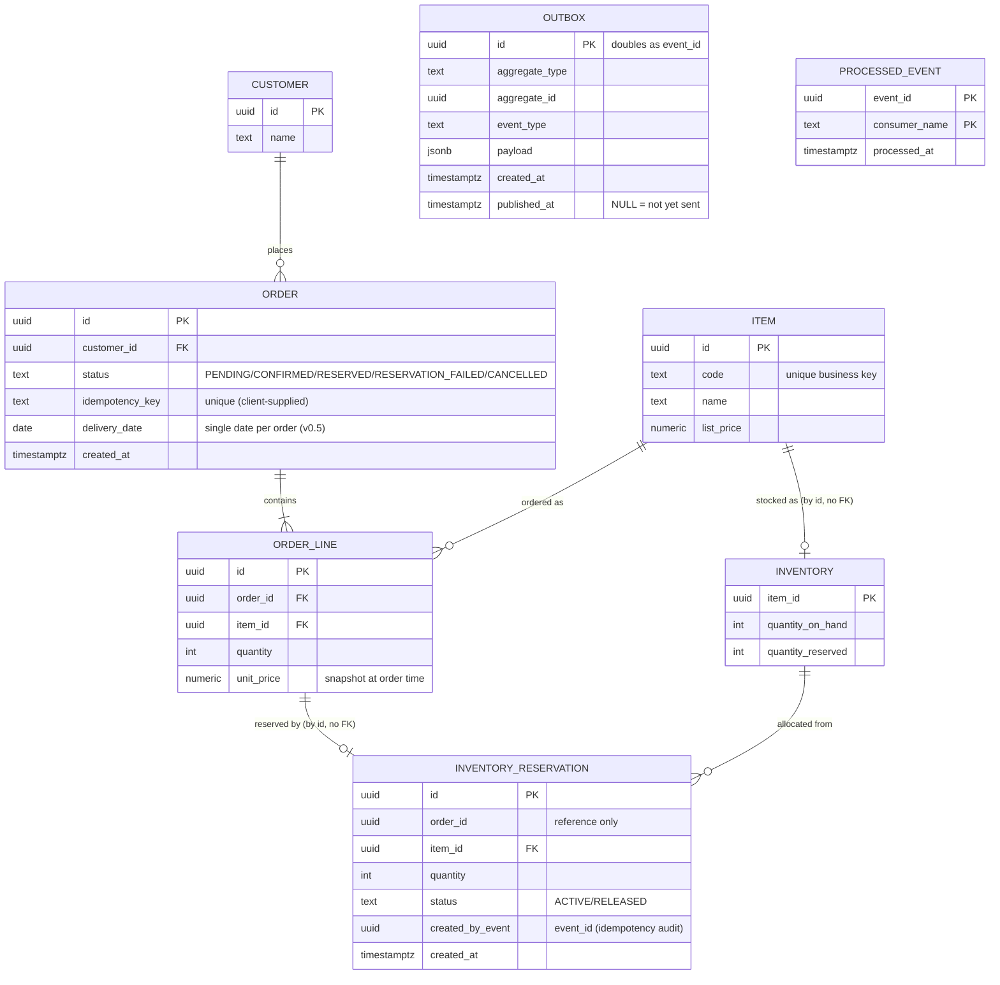

# Domain Design — event-driven-orders

> **Version**: 0.1 (draft) — 2026-07-13
> **Status**: work in progress. This document defines the domain model and
> event catalog before implementation starts. Broker selection rationale is
> documented separately in an ADR (planned).

---

## 1. Business Context

This project models a make-to-stock order-management domain for a small
manufacturing business: **order intake → inventory reservation → shipment
→ billing**, with a purchasing (procurement) side alongside.

The domain is grounded in business flows I observed first-hand in
professional work:

- **Order-management system for a metal-processing manufacturer**
  (replacement of a business web system; sole developer, 2022–2023):
  order intake with a header + order-lines structure (multiple items per
  order), inventory management, shipment instruction, and invoicing;
  purchasing (issuing purchase orders to suppliers) was also in scope.
- **Production-management package customization (MCFrame)** for a
  pharmaceutical manufacturer, where I first observed the concept of
  *inventory reservation* — allocating stock to a specific order.

**This repository is a personal portfolio project.** It does not reproduce
any employer's or client's system; it re-models generic domain flows,
informed by that experience, on a modern event-driven stack.

### Design principle: every state must be mechanically reproducible

A recurring pain point in the business systems above was integration-test
data: testing a downstream stage (e.g., shipment) requires upstream data
(orders, reservations) in exactly the right state, and constructing that
state by hand requires knowing every preceding step in detail. This
project treats that as a first-class design constraint:

> Any domain state used in a test must be reproducible mechanically —
> via factories and/or by replaying a recorded event sequence — never by
> hand-crafted one-off fixtures.

## 2. Scope (v0.5)

v0.5 models the **sell side only**: order intake and inventory
reservation, including the failure path.

**In scope**

- Order CRUD with HTTP-level idempotency (client-supplied `Idempotency-Key`)
- Order confirmation event published via a transactional outbox
  (custom Python poller relay — no Debezium)
- Inventory reservation by an idempotent consumer (`processed_events` table)
- Compensation (Saga) for reservation failure, with retry policy and a DLQ topic
- Observability: OpenTelemetry distributed tracing + structured logging
  (simplification is the designated de-scoping step if capacity runs short)
- CI: GitHub Actions (pytest + testcontainers + Redpanda)

**Out of scope / stretch** — deferred deliberately; see §6.

## 3. ER Diagram

### 3.1 Service ownership

| Schema | Owner service | Tables |
|---|---|---|
| `orders` | order-api | customers, orders, order_lines, items, outbox, processed_events |
| `inventory` | inventory-worker | inventory, inventory_reservations, outbox, processed_events |

One PostgreSQL instance locally, two schemas. **No cross-schema foreign
keys and no cross-schema queries** — the only integration path between the
two services is Kafka. `item_id` values in the `inventory` schema reference
the item master by convention only (seeded consistently), not by FK.
Both services own an `outbox` and a `processed_events` table because both
act as event producer *and* consumer.

### 3.2 Entity notes

- **customers** — seeded master data; no CRUD API in v0.5. Exists to keep
  the FK design realistic instead of a free-text customer name.
  De-scoping candidate if capacity runs short.
- **orders** — aggregate root of order intake. `status` lifecycle:
  `PENDING → CONFIRMED → RESERVED | RESERVATION_FAILED`; `CANCELLED` is
  reserved for future user-initiated cancellation. `idempotency_key` is
  the HTTP-level deduplication key (unique, client-supplied; the
  event-level mechanism is `processed_events`, see §4). Delivery date is
  a single header-level date in v0.5.
- **order_lines** — `unit_price` is a snapshot of the item's list price at
  order time: an accepted order must not change retroactively when the
  price master changes.
- **items** — owned by order-api. `code` is the human-facing business key;
  `id` (UUID) is the technical key used in FKs and event payloads.
- **inventory** — one row per item. Available quantity =
  `quantity_on_hand − quantity_reserved`. The row is locked
  (`SELECT … FOR UPDATE`) during reservation so the counter update and the
  reservation-row insert commit atomically.
- **inventory_reservations** — reservations are stored as rows, not just a
  counter, because (1) Saga compensation then has a precise inverse
  operation (mark the row `RELEASED` and decrement the counter), and
  (2) the rows are an audit trail of which order holds which stock.
  `created_by_event` records the event that created the reservation.
- **outbox** — one per schema; the transactional-outbox table. Events are
  written in the same DB transaction as the business change (avoiding the
  dual-write problem), then published to Kafka by a separate poller
  process. `id` doubles as the event id. The poller publishes rows where
  `published_at IS NULL` and marks them afterwards, so delivery is
  **at-least-once**.
- **processed_events** — consumer-side deduplication for at-least-once
  delivery: PK `(event_id, consumer_name)`; insert first, skip processing
  if the row already exists.

> Naming note: table names are plural (`orders`) because `order` is an SQL
> reserved word.

## 4. Event Catalog

<!-- TODO: envelope standard, topic/partition-key design, one entry per
     event: name, producer/consumers, payload summary, trigger condition,
     idempotency design. -->

## 5. Saga Overview — inventory reservation failure

<!-- TODO: High-level compensation flow only. Detailed Saga / retry / DLQ
     design is planned for a later design iteration (W3). -->

## 6. Out of Scope / Stretch

| Item | Why deferred |
|---|---|
| Purchasing (buy side) | Existed in the source domain, but v0.5 focuses on the event-driven sell-side flow; purchasing adds entities without adding new architectural lessons |
| Shipment & billing | Downstream stages; event names are reserved so the status model can grow (§4) |
| Per-line delivery dates (split delivery) | Requirement not confirmed in the source domain; a header-level date is enough for v0.5 |
| Item-master sync events | v0.5 syncs master data via seeds; event-carried master sync is a stretch topic |
| Debezium CDC | Custom poller chosen deliberately (broker ADR, planned) |
| CQRS read model | Stretch after v0.5 close |
| Public deployment | Handled by a separate AWS + Terraform task (October) |
