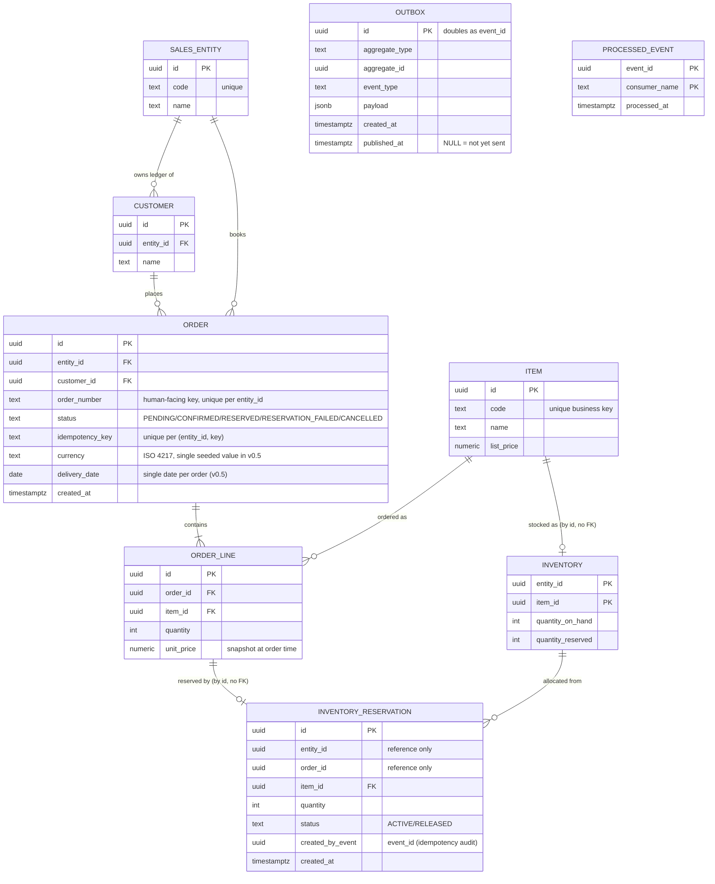

# Domain Design — event-driven-orders

> **Version**: 0.1 (draft) — 2026-07-13
> **Status**: work in progress.
> This document defines the domain model and event catalog before implementation starts.
> Broker selection rationale is documented separately in an ADR (planned).

---

## 1. Business Context

This project models a make-to-stock order-management domain for a small manufacturing business: **order intake → inventory reservation → shipment → billing**, with a purchasing (procurement) side alongside.

The domain is grounded in business flows I observed first-hand in professional work:

- **Order-management system for a metal-processing manufacturer** (replacement of a business web system; sole developer, 2022–2023): order intake with a header + order-lines structure (multiple items per order), inventory management, shipment instruction, and invoicing.
  Purchasing (issuing purchase orders to suppliers) was also in scope.
- **Production-management package customization (MCFrame)** for a pharmaceutical manufacturer, where I first observed the concept of *inventory reservation* — allocating stock to a specific order.
  This is also where I first worked on a system handling **multiple corporate entities within a single system**, the origin of the *multi-entity* axis carried in this schema (§3.2).
- **Finance/accounting web system for a supermarket group** (2015–2019): the group's accounting included consolidated reporting across multiple group companies.
  This is a related but distinct exposure — cross-company consolidation in financial reporting, not first-hand experience with a single system modeling multiple entities — and does not by itself claim detailed per-entity bookkeeping experience.
  The multi-entity requirement itself is also a staple of accounting/finance SaaS product descriptions.

**This repository is a personal portfolio project.**
It does not reproduce any employer's or client's system; it re-models generic domain flows, informed by that experience, on a modern event-driven stack.

### Design principle: every state must be mechanically reproducible

A recurring pain point in the business systems above was integration-test data: testing a downstream stage (e.g., shipment) requires upstream data (orders, reservations) in exactly the right state, and constructing that state by hand requires knowing every preceding step in detail.
This project treats that as a first-class design constraint:

> Any domain state used in a test must be reproducible mechanically — via factories and/or by replaying a recorded event sequence — never by hand-crafted one-off fixtures.

Two complementary techniques satisfy this constraint:

- **Factories** build a target state directly (e.g., an order already in `RESERVATION_FAILED` state) through a single parameterized helper, hiding the cross-table consistency logic in one place instead of re-deriving it by hand in every test.
- **Event replay** builds the same state by publishing real domain events (e.g. `OrderConfirmed`) and letting the real consumers process them, exercising the production code path itself rather than a test-only shortcut.
  This is the higher-fidelity option and the natural fit for testing the Saga/outbox/idempotency machinery this project centers on.

Factories are the default for unit- and API-level tests; event replay is reserved for integration tests that verify the Saga wiring end to end.

## 2. Scope (v0.5)

v0.5 models the **sell side only**: order intake and inventory reservation, including the failure path.

**In scope**

- Order CRUD with HTTP-level idempotency (client-supplied `Idempotency-Key`)
- Order confirmation event published via a transactional outbox (custom Python poller relay — no Debezium)
- Inventory reservation by an idempotent consumer (`processed_events` table)
- Compensation (Saga) for reservation failure, with retry policy and a DLQ topic
- Observability: OpenTelemetry distributed tracing + structured logging (simplification is the designated de-scoping step if capacity runs short)
- CI: GitHub Actions (pytest + testcontainers + Redpanda)

**Multi-entity note**: the schema and event envelope carry an `entity_id` (sales company) from day one, but v0.5 seeds exactly **one** entity and implements no entity-scoped features.
Rationale in §3.2 and §6.

**Out of scope / stretch** — deferred deliberately; see §6.

## 3. ER Diagram



### 3.1 Service ownership

| Schema | Owner service | Tables |
|---|---|---|
| `orders` | order-api | sales_entities, customers, orders, order_lines, items, outbox, processed_events |
| `inventory` | inventory-worker | inventory, inventory_reservations, outbox, processed_events |

One PostgreSQL instance locally, two schemas.
**No cross-schema foreign keys and no cross-schema queries** — the only integration path between the two services is Kafka.
`item_id` / `entity_id` values in the `inventory` schema reference the masters by convention only (seeded consistently), not by FK.
Both services own an `outbox` and a `processed_events` table because both act as event producer *and* consumer.

### 3.2 Entity notes

- **sales_entities** — master of sales companies (corporate entities), the "multi-entity" axis common in accounting/finance SaaS.
  v0.5 seeds exactly one entity and implements no entity-scoped features.
  The `entity_id` column is nevertheless baked into the schema and the event envelope from day one: retrofitting it later means rewriting every table and every event, while deferring only the *functional* layer (data-isolation guarantees, per-entity document numbering, API scoping) keeps the de-scoping decision reversible (§6).
- **customers** — seeded master data, scoped to a sales entity; no CRUD API in v0.5.
  Exists to keep the FK design realistic instead of a free-text customer name.
  De-scoping candidate if capacity runs short.
- **orders** — aggregate root of order intake.
  `status` lifecycle: `PENDING → CONFIRMED → RESERVED | RESERVATION_FAILED`; `CANCELLED` is reserved for future user-initiated cancellation.
  `order_number` is the human-facing business key (unique per `entity_id`), separate from the technical `id`; it is included from v0.5 — even though no numbering scheme beyond a simple sequence exists yet — because retrofitting it later would require backfilling every existing row with a number.
  `idempotency_key` is the HTTP-level deduplication key (client-supplied, unique per `(entity_id, idempotency_key)`; the event-level mechanism is `processed_events`, see §4.4).
  `currency` (ISO 4217) is seeded as a single value in v0.5; it is carried on the order because a monetary amount recorded without its currency cannot be reinterpreted later without a breaking change to the event payload.
  Delivery date is a single header-level date in v0.5.
- **order_lines** — `unit_price` is a snapshot of the item's list price at order time: an accepted order must not change retroactively when the price master changes.
- **items** — owned by order-api.
  `code` is the human-facing business key; `id` (UUID) is the technical key used in FKs and event payloads.
  The catalog is shared across sales entities in v0.5; per-entity catalogs are part of the deferred multi-entity functional layer (§6).
- **inventory** — one row per `(entity_id, item_id)`: each sales entity holds its own stock.
  Available quantity = `quantity_on_hand − quantity_reserved`.
  The row is locked (`SELECT … FOR UPDATE`) during reservation so the counter update and the reservation-row insert commit atomically.
- **inventory_reservations** — reservations are stored as rows, not just a counter, because (1) Saga compensation then has a precise inverse operation (mark the row `RELEASED` and decrement the counter), and (2) the rows are an audit trail of which order holds which stock.
  `created_by_event` records the event that created the reservation.
- **outbox** — one per schema; the transactional-outbox table.
  Events are written in the same DB transaction as the business change (avoiding the dual-write problem), then published to Kafka by a separate poller process.
  `id` doubles as the event id.
  The poller publishes rows where `published_at IS NULL` and marks them afterwards, so delivery is **at-least-once**.
- **processed_events** — consumer-side deduplication for at-least-once delivery: PK `(event_id, consumer_name)`; insert first, skip processing if the row already exists.

> Naming note: table names are plural (`orders`) because `order` is an SQL reserved word.

## 4. Event Catalog

### 4.1 Envelope standard

All events share one envelope; `payload` differs per event type.

```json
{
  "event_id": "0198c0de-…",
  "event_type": "OrderConfirmed",
  "event_version": 1,
  "occurred_at": "2026-08-15T09:30:00Z",
  "entity_id": "<sales_entity_id>",
  "aggregate_type": "Order",
  "aggregate_id": "<order_id>",
  "payload": {}
}
```

- `event_id` is the outbox row's UUID and is the deduplication key (§4.4).
- `event_version` is always `1` in v0.5; the field exists so payload-schema evolution has a defined place to happen (no schema registry in v0.5 — broker ADR, planned).
- Event names are **past-tense facts** (`OrderConfirmed`, never `ConfirmOrder`): an event records something that already happened and cannot be rejected.
  Failures are therefore handled by appending compensating facts, not by undoing (§5).

### 4.2 Topics and partitioning

| Topic | Producer | Contents |
|---|---|---|
| `orders.events` | order-api | all order-aggregate events |
| `inventory.events` | inventory-worker | all inventory-aggregate events |
| `<topic>.<consumer>.dlq` | (consumer) | dead-letter topic per consumer |

- **Message key = `order_id`.** Kafka guarantees ordering only within a partition; keying by order id keeps all events about one order in order.
- **One topic per service, not per event type**: if events of the same aggregate were spread across topics, the per-order ordering guarantee would be lost.

### 4.3 Events (v0.5)

#### OrderConfirmed

| | |
|---|---|
| Producer → consumers | order-api → inventory-worker |
| Trigger | `POST /orders/{id}/confirm` transitions the order `PENDING → CONFIRMED`; the outbox row is written in the same DB transaction |
| Payload | `order_id`, `order_number`, `customer_id`, `delivery_date`, `currency`, `lines: [{item_id, quantity}]` |

Payload style is **event-carried state transfer**: the consumer gets everything it needs (the order lines) from the event itself and never calls order-api back.
A notification-style event (id only) would reintroduce a synchronous dependency and defeat the purpose of the async design; the price is that the payload schema becomes a contract, tracked by `event_version`.

#### InventoryReserved

| | |
|---|---|
| Producer → consumers | inventory-worker → order-api |
| Trigger | **All** lines of the order were reserved in one local DB transaction (all-or-nothing per order) |
| Payload | `order_id`, `reservations: [{item_id, quantity, reservation_id}]` |

On consumption, order-api transitions the order `CONFIRMED → RESERVED`.

#### InventoryReservationFailed

| | |
|---|---|
| Producer → consumers | inventory-worker → order-api |
| Trigger | At least one line had insufficient available stock; the whole reservation transaction rolled back, so no partial reservations remain |
| Payload | `order_id`, `failures: [{item_id, requested, available}]` |

On consumption, order-api transitions the order `CONFIRMED → RESERVATION_FAILED` (the Saga compensation, §5).

The payload deliberately carries `requested` vs `available` per failed line — exactly the information an operator (or a future automated order-splitting feature, §6) needs to decide how to split the order into a fulfillable part and a backorder.
The event design anticipates that capability without implementing it.

### 4.4 Idempotency design

Two independent layers:

| Layer | Key | Store | Protects against |
|---|---|---|---|
| HTTP | client-supplied `Idempotency-Key` header, unique per `(entity_id, key)` | Redis | client retries creating duplicate orders |
| Event | `event_id` (outbox row UUID) | `processed_events` | at-least-once redelivery (outbox poller resend, consumer restart/rebalance) |

**Rejected alternative** — deduplicating on a business key (`order_id` + state transition): it cannot distinguish a legitimate re-processing of the same order (e.g. a future cancel-and-reconfirm flow) from a duplicate delivery.
The outbox supplies a fresh UUID per event for free, so `event_id` deduplication is both simpler and more precise.

### 4.5 Reserved future events (not implemented in v0.5)

`OrderCancelled`, `OrderShipped`, `InvoiceIssued` — names reserved so the status model and topic layout can grow toward the shipment/billing stages listed in §6.

## 5. Saga Overview — inventory reservation failure

> High-level flow only.
> Retry policy, DLQ handling, and edge cases are the subject of a dedicated design iteration (planned: W3).

### 5.1 Why a Saga (and not a distributed transaction)

The order confirmation spans two services and a broker; there is no shared transaction coordinator, and two-phase commit across services would couple their availability (one slow participant blocks the other's locks).
The Saga pattern replaces the global transaction with a **sequence of local transactions**, each atomic on its own, where a failure later in the chain is answered by a **compensating action** — a new fact that semantically cancels an earlier one, never an undo.
(The accounting analogy: a posted journal entry is corrected by a reversing entry, not by erasure.)

v0.5 uses **choreography** (each service reacts to events; no central orchestrator): with two services and one interaction, an orchestrator would be pure overhead.
The trade-off — choreographed flows get hard to follow as the number of steps grows — is documented as the trigger for revisiting this choice if the flow ever gains steps.

### 5.2 Flow

```mermaid
sequenceDiagram
    participant C as Client
    participant O as order-api
    participant K as Kafka
    participant I as inventory-worker

    C->>O: POST /orders/{id}/confirm
    O->>O: tx: status PENDING→CONFIRMED + outbox(OrderConfirmed)
    O-->>C: 200 OK (status=CONFIRMED; reservation is async)
    O->>K: poller publishes OrderConfirmed
    K->>I: OrderConfirmed
    alt all lines available
        I->>I: tx: reservations + counters + processed_event + outbox(InventoryReserved)
        I->>K: poller publishes InventoryReserved
        K->>O: InventoryReserved
        O->>O: tx: processed_event + status CONFIRMED→RESERVED
    else insufficient stock (business failure)
        I->>I: tx: processed_event + outbox(InventoryReservationFailed) — no reservation rows
        I->>K: poller publishes InventoryReservationFailed
        K->>O: InventoryReservationFailed
        O->>O: tx: processed_event + status CONFIRMED→RESERVATION_FAILED (compensation)
    end
```

The client observes the outcome by polling `GET /orders/{id}` (the confirm endpoint answers as soon as the order is confirmed; the reservation result arrives asynchronously).

### 5.3 Business failure vs technical failure

A subtlety that shapes the consumer implementation:

- **Business failure** (insufficient stock) is a *successful* processing outcome.
  The consumer's transaction **commits** — recording the `processed_events` row and the `InventoryReservationFailed` outbox row, while writing no reservation rows.
  It must not be retried.
- **Technical failure** (DB down, crash mid-processing) aborts the whole transaction *including* the `processed_events` insert, so at-least-once redelivery retries it safely.
  After N failed attempts the event goes to the consumer's DLQ topic for manual inspection (retry count and DLQ operations: W3 design).

Conflating these two — e.g. rolling back everything on insufficient stock — would make the consumer retry a permanent business condition forever.

## 6. Out of Scope / Stretch

Some deferred items still leave a mark on the v0.5 schema: a column or envelope field is added now even though the feature built on top of it is not.

> A field is baked in now when retrofitting it later would cascade into a primary key, a unique constraint, or an event-payload contract, or would require backfilling existing rows with an interpretation that cannot be recovered after the fact.
> It is left out (no schema footprint) when it can be added later as a plain nullable column with no such cascade.
> The criterion is never "might want it later" — a schema this thin cannot afford speculative columns either.

`entity_id`, `order_number`, and `orders.currency` are the fields baked in under this criterion so far.
See the **Schema footprint** column below.

| Item | Why deferred | Schema footprint |
|---|---|---|
| Purchasing (buy side) | Existed in the source domain, but v0.5 focuses on the event-driven sell-side flow; purchasing adds entities without adding new architectural lessons | None |
| Shipment & billing | Downstream stages; event names are reserved so the status model can grow (§4.5) | None (new tables when built) |
| Multi-entity **functional layer** (data isolation, per-entity numbering, API scoping) | The `entity_id` column and envelope field are baked in from day one (retrofitting would touch every table and event); the functional layer is deferred work and the designated **first de-scoping candidate**. Baking in the column keeps that decision reversible | `entity_id` on all tables and the envelope; `order_number` exists but uses a plain sequence, not a per-entity scheme |
| Multi-currency support (FX conversion, multi-currency reporting) | v0.5 seeds a single currency; full support pairs with Flagship #1's multi-currency work (a separate portfolio project) and is out of scope here | `orders.currency` (single seeded value, no conversion logic) |
| Order splitting / backorder | The realistic business follow-up to a failed reservation; deferred because partial fulfillment multiplies Saga states. `InventoryReservationFailed` already carries requested-vs-available, so the capability can be added without changing events | None |
| Per-line delivery dates (split delivery) | Requirement not confirmed in the source domain; a header-level date is enough for v0.5 | None |
| Item-master sync events | v0.5 syncs master data via seeds; event-carried master sync is a stretch topic | None |
| Debezium CDC | Custom poller chosen deliberately (broker ADR, planned) | N/A |
| CQRS read model | Stretch after v0.5 close | N/A |
| Public deployment | Handled by a separate AWS + Terraform task (October) | N/A |
